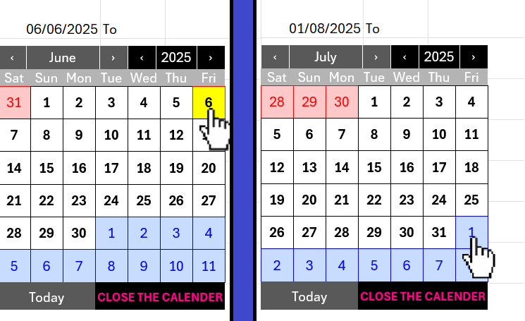

VBA codes that
1- create the shape based calendar. 
2- sync calender.
3- code to group it . other code to show it when selecting column A

❗❗❗❗❗❗‼️‼️‼️‼️
if you want to change start day

1-    search for this "dayOffset = i - Weekday(firstDay, vbSaturday)"
      change Saturday to the wanted day like Monday 
      "dayOffset = i - Weekday(firstDay, vbMonday)"
      
2-    also change this ""Sat", "Sun", "Mon", "Tue", "Wed", "Thu", "Fri")"
      to 
      this "("Mon", "Tue", "Wed", "Thu", "Fri", "Sat", "Sun")"
